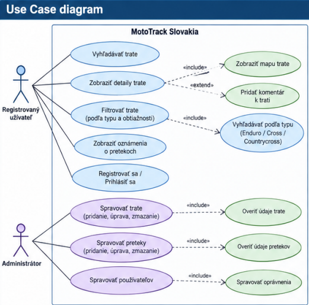
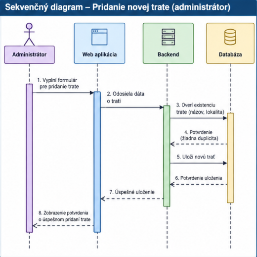
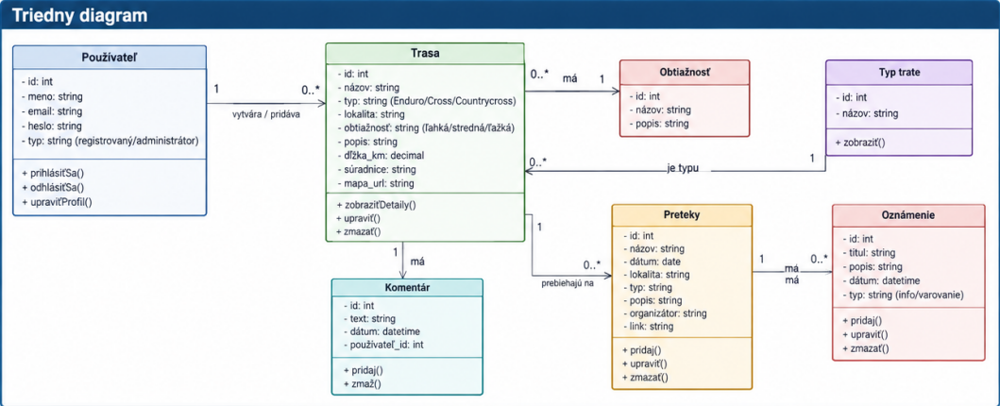

# Systémová analýza projektu

## Názov projektu (+ meno riešiteľa)
- **Názov projektu**: MotoTrack Slovakia – databáza motokrosových, enduro a countrycross tratí
- **Meno riešiteľa**: Matúš Mlích

---

## Seznam kapitol - částí projektu
1. Úvod
2. Dôvod a okolnosti zavedenia riešenia
3. Popis projektu (slovné zadanie, popis od zákazníka)
4. Analýza požiadaviek
5. Systémové požiadavky (FURPS)
6. Kritické situácie
7. Hranice systému
8. Kontext prostredia
9. Charakteristika aktérov
10. Use Case diagram
11. Scenáre (Implementácia Use Case)
12. Sekvenčný diagram
13. Triedny diagram
14. Záver

---

## 1. Úvod

Projekt je zameraný na vytvorenie webovej aplikácie pre motokrosových, enduro a countrycross jazdcov na Slovensku. Aplikácia bude slúžiť ako prehľadné miesto, kde používateľ nájde informácie o tratiach, ich lokalite a obtiažnosti, a zároveň aktuálne oznámenia o pripravovaných pretekoch.

Systém je navrhnutý s dvoma rolami. Bežný používateľ obsah iba **prezerá, vyhľadáva a filtruje** – nemusí sa registrovať ani prihlasovať. Administrátor je jediný, kto obsah do systému **pridáva, upravuje a odstraňuje**, a preto sa musí prihlásiť.

---

## 2. Dôvod a okolnosti zavedenia riešenia

Informácie o motokrosových, enduro a countrycross tratiach sú často rozdelené medzi rôzne webové stránky, sociálne siete, kluby a skupiny. Jazdec tak môže mať problém rýchlo zistiť, kde sa konkrétna trať nachádza, aký typ trate ponúka a aká je jej obtiažnosť.

Zavedenie jednotného systému umožní sústrediť tieto informácie na jedno miesto. Používateľ bude mať jednoduchý prehľad o tratiach na Slovensku a zároveň bude môcť sledovať oznámenia o pripravovaných pretekoch.

Cieľom systému je najmä:
- vytvoriť databázu motokrosových, enduro a countrycross tratí,
- umožniť vyhľadávanie a filtrovanie tratí,
- zobrazovať obtiažnosť jednotlivých tratí,
- poskytovať základné informácie o lokalite trate,
- zobrazovať oznámenia o pretekoch,
- umožniť administrátorovi spravovať obsah systému.

---

## 3. Popis projektu (slovné zadanie, popis od zákazníka)

Cieľom projektu je vytvoriť prehľadnú webovú aplikáciu pre jazdcov a fanúšikov motokrosu a endura. Systém bude obsahovať databázu tratí nachádzajúcich sa na Slovensku.

Každá trať bude mať svoje základné údaje, napríklad:
- názov trate,
- lokalitu,
- typ trate – **enduro, cross alebo countrycross**,
- stupeň obtiažnosti,
- stručný popis,
- prípadne ďalšie informácie podľa administrátora.

Súčasťou systému bude aj sekcia **Oznámenia o pretekoch**. Administrátor bude môcť vytvoriť oznámenie, ktoré bude obsahovať napríklad názov pretekov, dátum, miesto konania, typ pretekov a ďalšie informácie.

Bežný používateľ bude môcť (bez prihlásenia):
- prezerať zoznam tratí,
- vyhľadávať trate podľa názvu alebo lokality,
- filtrovať trate podľa typu a obtiažnosti,
- zobraziť detail trate,
- prezerať aktuálne oznámenia o pretekoch.

Bežný používateľ **nebude môcť** do systému nič pridávať ani meniť – nemá k dispozícii registráciu, hodnotenie ani komentáre.

Administrátor sa prihlási a bude môcť navyše:
- pridávať trate,
- upravovať trate,
- mazať trate,
- pridávať oznámenia o pretekoch,
- upravovať oznámenia,
- mazať oznámenia.

---

## 4. Analýza požiadaviek

### Funkčné požiadavky

**FR1 – Zobrazenie tratí**
- Systém zobrazí zoznam dostupných tratí.
- Pri každej trati sa zobrazí názov, typ a obtiažnosť.
- Zoznam je dostupný bez prihlásenia.

**FR2 – Vyhľadávanie a filtrovanie**
- Používateľ môže vyhľadávať trať podľa názvu alebo lokality.
- Používateľ môže filtrovať trate podľa typu (enduro / cross / countrycross).
- Používateľ môže filtrovať trate podľa obtiažnosti (ľahká / stredná / ťažká).
- Filtre je možné kombinovať.

**FR3 – Detail trate**
- Systém zobrazí detail vybranej trate.
- Detail obsahuje základné informácie o trati a jej lokalite.

**FR4 – Oznámenia o pretekoch**
- Systém zobrazí zoznam aktuálnych oznámení.
- Používateľ môže otvoriť detail konkrétneho oznámenia.

**FR5 – Prihlásenie administrátora**
- Systém umožní administrátorovi prihlásiť sa pomocou mena a hesla.
- Po prihlásení sa administrátorovi sprístupní administračná časť.
- Systém umožní administrátorovi odhlásiť sa.
- Bez prihlásenia nie sú administračné funkcie dostupné.

**FR6 – Správa tratí administrátorom**
- Administrátor môže vytvoriť novú trať.
- Administrátor môže existujúcu trať upraviť.
- Administrátor môže trať odstrániť.
- Systém pred uložením overí povinné údaje.

**FR7 – Správa oznámení administrátorom**
- Administrátor môže vytvoriť nové oznámenie o pretekoch.
- Administrátor môže oznámenie upraviť.
- Administrátor môže oznámenie odstrániť.
- Systém pred uložením overí povinné údaje.

### Nefunkčné požiadavky

- Zoznam tratí sa načíta najneskôr do 2 sekúnd pri bežnom pripojení.
- Vyhľadávanie a filtrovanie vráti výsledok do 1 sekundy.
- Systém zvládne aspoň 50 súbežne pracujúcich používateľov bez výrazného spomalenia.
- Rozhranie je použiteľné na obrazovkách so šírkou od 360 px (mobil) až po bežný monitor.
- Údaje uložené v databáze musia byť konzistentné – neúplná trať alebo oznámenie sa neuloží.
- Administrátorské funkcie sú dostupné iba po prihlásení; heslo sa v databáze ukladá v zašifrovanej podobe.

---

## 5. Systémové požiadavky (FURPS)

### 1. Funkčnosť (Functionality – F)

- Zobrazenie databázy motokrosových, enduro a countrycross tratí.
- Vyhľadávanie a filtrovanie tratí podľa názvu, lokality, typu a obtiažnosti.
- Zobrazenie detailných informácií o trati vrátane obtiažnosti.
- Zobrazenie oznámení o pripravovaných pretekoch.
- Prihlásenie a odhlásenie administrátora.
- Správa tratí administrátorom (pridanie, úprava, odstránenie).
- Správa oznámení administrátorom (pridanie, úprava, odstránenie).

### 2. Vhodnosť k použitiu (Usability – U)

- Jednoduché a intuitívne používateľské rozhranie bez nutnosti registrácie.
- Prehľadné rozdelenie tratí podľa typu.
- Jednoduché filtrovanie podľa obtiažnosti.
- Použiteľnosť na počítači aj mobilnom zariadení.
- Chybové hlásenia sú formulované zrozumiteľne v slovenčine.

### 3. Spoľahlivosť (Reliability – R)

- Systém má správne zobrazovať uložené údaje.
- Pri chybe databázy alebo servera má systém používateľa informovať o probléme.
- Úprava alebo odstránenie údajov má byť vykonaná konzistentne.
- Pri neúspešnom uložení sa v databáze nesmie objaviť neúplný záznam.

### 4. Výkon (Performance – P)

- Zoznam tratí sa načíta do 2 sekúnd.
- Filtrovanie a vyhľadávanie prebehne do 1 sekundy.
- Systém zvládne aspoň 50 súbežných používateľov.

### 5. Schopnosť údržby (Supportability – S)

- Jednoduché pridávanie nových tratí a typov údajov.
- Typy tratí a stupne obtiažnosti sú uložené ako samostatné číselníky, takže sa dajú rozšíriť bez zásahu do kódu.
- Možnosť rozšíriť systém o ďalšie funkcie v budúcnosti.
- Zdrojový kód má byť organizovaný tak, aby sa dal ďalej upravovať.

---

## 6. Kritické situácie

### 1. Systémové

- **Výpadok servera:** Používateľ sa nebude môcť dostať k databáze tratí a oznámeniam.
- **Výpadok databázy:** Systém nebude schopný načítať alebo uložiť údaje.
- **Strata údajov:** Pri poškodení databázy môže dôjsť k strate informácií o tratiach alebo pretekoch.

### 2. Aplikačné

- **Neplatné údaje:** Administrátor sa pokúsi vytvoriť trať bez povinných údajov.
- **Duplicitná trať:** Administrátor sa pokúsi pridať trať s rovnakým názvom a lokalitou, aká už v databáze existuje.
- **Chyba pri ukladaní:** Údaje sa nepodarí uložiť do databázy.
- **Neoprávnený prístup:** Neprihlásený návštevník sa pokúsi otvoriť administračnú stránku.
- **Vypršanie prihlásenia:** Administrátorovi vyprší relácia počas vypĺňania formulára.
- **Neexistujúca trať:** Používateľ otvorí odkaz na trať, ktorá bola odstránená.

Systém v týchto prípadoch zobrazí zrozumiteľné chybové hlásenie a umožní používateľovi pokračovať v práci s aplikáciou.

---

## 7. Hranice systému

### 1. Ideálny scenár

Používateľ otvorí aplikáciu, vyhľadá požadovanú lokalitu alebo typ trate, vyfiltruje požadovanú obtiažnosť a zobrazí detail vybranej trate. Zároveň môže skontrolovať aktuálne oznámenia o pretekoch.

### 2. Hranične riešiteľný scenár

Používateľ hľadá trať, ktorá sa v databáze nenachádza, alebo zvolí kombináciu filtrov bez výsledku. Systém v oboch prípadoch zobrazí hlásenie „Žiadna trať nebola nájdená“ a ponúkne zrušenie filtrov.

### 3. Situácie, ktoré systém nezvládne

Systém nebude schopný poskytovať informácie, ktoré nie sú uložené v databáze alebo ktoré neboli pridané administrátorom. Nebude tiež zodpovedať za aktuálny stav trate, ak tieto informácie administrátor nezmení. Systém neumožňuje bežným používateľom vkladať vlastný obsah, takže údaje sú vždy len v takom rozsahu a kvalite, v akej ich udržiava administrátor.

---

## 8. Kontext prostredia

Systém bude implementovaný ako webová aplikácia dostupná prostredníctvom internetového prehliadača. Bude pracovať s databázou, v ktorej budú uložené informácie o tratiach a oznámeniach.

Používateľ bude systém používať prostredníctvom:
- počítača,
- notebooku,
- tabletu,
- mobilného telefónu.

Systém bude závisieť najmä od:
- webového servera (aplikačná logika),
- databázového systému (uloženie tratí a oznámení),
- internetového pripojenia,
- webového prehliadača na strane používateľa.

---

## 9. Charakteristika aktérov

### Bežný používateľ / jazdec

Používateľ, ktorý chce nájsť vhodnú motokrosovú, enduro alebo countrycross trať alebo získať informácie o pripravovaných pretekoch. Systém používa bez prihlásenia a obsah iba číta.

**Môže:**
- prezerať zoznam tratí,
- vyhľadávať trate podľa názvu a lokality,
- filtrovať trate podľa typu a obtiažnosti,
- zobrazovať detail trate,
- prezerať oznámenia o pretekoch.

**Nemôže:**
- pridávať, upravovať ani mazať akýkoľvek obsah.

### Administrátor

Používateľ s rozšírenými oprávneniami, ktorý sa stará o obsah systému. Pred prácou s obsahom sa musí prihlásiť.

**Môže:**
- všetko, čo bežný používateľ,
- prihlásiť sa a odhlásiť,
- pridávať, upravovať a mazať trate,
- pridávať, upravovať a mazať oznámenia o pretekoch.

---

## 10. Use Case diagram

Diagram zobrazuje dvoch aktérov. Bežný používateľ má prípady použitia zamerané na prezeranie obsahu (vyhľadávanie, filtrovanie, detail trate, oznámenia). Administrátor má navyše prípady použitia na správu tratí a oznámení, ktoré cez väzbu «include» vždy zahŕňajú prihlásenie a overenie zadaných údajov.

---

## 11. Scenáre (Implementácia Use Case)

### 1. Vyhľadanie a zobrazenie trate

- **Názov:** Vyhľadanie enduro trate podľa lokality
- **Kontext:** Jazdec chce nájsť enduro trať v požadovanej lokalite.
- **Level zanoření Use Case:** Hlavný scenár
- **Aktéri:** Bežný používateľ
- **Stakeholdeři a zájmové osoby:** Jazdci, návštevníci tratí, prevádzkovatelia tratí
- **Vstupné podmienky:** Systém obsahuje databázu tratí. Prihlásenie nie je potrebné.
- **Výstupné podmienky:** Zobrazí sa zoznam zodpovedajúcich tratí.
- **Minimálny výstup:** Zobrazenie názvu a typu trate.
- **Ideálny výstup:** Zobrazenie všetkých relevantných informácií o vybranej trati.

**Hlavný scénár:**
1. Používateľ otvorí stránku s traťami.
2. Do vyhľadávania zadá názov alebo lokalitu.
3. Systém vyhľadá zodpovedajúce trate.
4. Systém zobrazí výsledky.
5. Používateľ vyberie konkrétnu trať.
6. Systém zobrazí detail trate vrátane typu a obtiažnosti.

**Rozšírenie:**
- Ak sa žiadna trať nenájde, systém zobrazí hlásenie „Žiadna trať nebola nájdená“.
- Ak bola trať medzitým odstránená, systém zobrazí hlásenie, že trať už nie je dostupná, a vráti používateľa na zoznam.

---

### 2. Filtrovanie tratí podľa obtiažnosti

- **Názov:** Výber trate podľa obtiažnosti
- **Kontext:** Jazdec chce nájsť trať zodpovedajúcu jeho úrovni.
- **Level zanoření Use Case:** Hlavný scenár
- **Aktéri:** Bežný používateľ
- **Vstupné podmienky:** V databáze sa nachádzajú trate s definovanou obtiažnosťou.
- **Výstupné podmienky:** Systém zobrazí iba trate zodpovedajúce zvolenému filtru.

**Hlavný scénár:**
1. Používateľ otvorí zoznam tratí.
2. Vyberie požadovaný stupeň obtiažnosti.
3. Prípadne doplní filter podľa typu trate.
4. Systém aplikuje filtre.
5. Systém zobrazí zodpovedajúce trate.

**Rozšírenie:**
- Ak neexistuje žiadna trať zodpovedajúca filtrom, systém zobrazí hlásenie „Žiadna trať nebola nájdená“ a ponúkne zrušenie filtrov.

---

### 3. Zobrazenie oznámenia o pretekoch

- **Názov:** Zobrazenie informácií o pripravovaných pretekoch
- **Kontext:** Jazdec chce získať informácie o pripravovanom podujatí.
- **Level zanoření Use Case:** Hlavný scenár
- **Aktéri:** Bežný používateľ
- **Vstupné podmienky:** V systéme existuje aspoň jedno oznámenie.
- **Výstupné podmienky:** Používateľ vidí podrobnosti o pretekoch.

**Hlavný scénár:**
1. Používateľ otvorí sekciu Oznámenia.
2. Systém zobrazí zoznam oznámení zoradený podľa dátumu konania.
3. Používateľ vyberie konkrétne preteky.
4. Systém zobrazí detail oznámenia.
5. Používateľ si prečíta dátum, miesto a ďalšie informácie.

**Rozšírenie:**
- Ak oznámenie už nie je dostupné, systém zobrazí hlásenie, že oznámenie nebolo nájdené.

---

### 4. Prihlásenie administrátora

- **Názov:** Prihlásenie do administračnej časti
- **Kontext:** Administrátor potrebuje prístup k správe obsahu.
- **Level zanoření Use Case:** Podriadený scenár (vstupuje do scenárov 5 a 6)
- **Aktéri:** Administrátor
- **Vstupné podmienky:** Administrátorský účet existuje v systéme.
- **Výstupné podmienky:** Administrátor má prístup k administračnej časti.

**Hlavný scénár:**
1. Administrátor otvorí prihlasovaciu stránku.
2. Zadá prihlasovacie meno a heslo.
3. Systém overí údaje.
4. Systém sprístupní administračnú časť.

**Rozšírenie:**
- Pri nesprávnych údajoch systém zobrazí hlásenie „Nesprávne meno alebo heslo“ a prihlásenie neumožní.
- Ak neprihlásený návštevník otvorí administračnú adresu, systém ho presmeruje na prihlásenie.

---

### 5. Pridanie trate administrátorom

- **Názov:** Pridanie novej trate
- **Kontext:** Administrátor chce pridať novú trať do databázy.
- **Level zanoření Use Case:** Hlavný scenár
- **Aktéri:** Administrátor
- **Vstupné podmienky:** Administrátor je prihlásený (scenár 4).
- **Výstupné podmienky:** Nová trať je uložená v databáze a viditeľná v zozname.

**Hlavný scénár:**
1. Administrátor otvorí administráciu tratí.
2. Vyberie možnosť „Pridať trať“.
3. Vyplní názov, lokalitu, typ a obtiažnosť trate.
4. Doplní popis a ďalšie údaje.
5. Potvrdí uloženie.
6. Systém skontroluje povinné údaje a overí, či trať s rovnakým názvom a lokalitou už neexistuje.
7. Systém uloží trať do databázy.
8. Systém zobrazí potvrdenie a nová trať sa objaví v zozname.

**Rozšírenie:**
- Ak chýba povinný údaj, systém trať neuloží a zobrazí upozornenie pri príslušnom poli.
- Ak trať už existuje, systém upozorní na duplicitu.
- Ak zlyhá zápis do databázy, systém zobrazí chybové hlásenie a zadané údaje zostanú vo formulári.

---

### 6. Pridanie oznámenia o pretekoch

- **Názov:** Vytvorenie oznámenia o pretekoch
- **Kontext:** Administrátor chce informovať používateľov o pripravovaných pretekoch.
- **Level zanoření Use Case:** Hlavný scenár
- **Aktéri:** Administrátor
- **Vstupné podmienky:** Administrátor je prihlásený (scenár 4).
- **Výstupné podmienky:** Oznámenie je uložené a zobrazené používateľom.

**Hlavný scénár:**
1. Administrátor otvorí administráciu oznámení.
2. Vyberie možnosť „Pridať oznámenie“.
3. Zadá názov pretekov.
4. Zadá dátum a miesto konania.
5. Vyberie typ pretekov.
6. Doplní podrobnosti.
7. Potvrdí uloženie.
8. Systém skontroluje údaje.
9. Systém uloží oznámenie.
10. Oznámenie sa zobrazí v sekcii pre používateľov.

**Rozšírenie:**
- Ak administrátor nezadá povinné údaje, systém oznámenie neuloží a zobrazí upozornenie.
- Ak je zadaný dátum v minulosti, systém na to upozorní.

---

## 12. Sekvenčný diagram

---

## 13. Triedny diagram

---

## 14. Záver

Navrhovaný systém MotoTrack Slovakia má za cieľ vytvoriť jednotné miesto pre informácie o motokrosových, enduro a countrycross tratiach na Slovensku a o pripravovaných pretekoch.

Systém je zámerne navrhnutý s jednoduchým rozdelením rolí: bežný používateľ obsah iba prezerá, vyhľadáva a filtruje, zatiaľ čo administrátor sa stará o napĺňanie a aktualizáciu obsahu. Vďaka tomu je aplikácia jednoduchá na použitie a obsah zostáva pod kontrolou.

Návrh je vytvorený tak, aby sa dal v budúcnosti rozšíriť napríklad o mapové zobrazenie tratí, fotografie, hodnotenie tratí, registráciu používateľov, komentáre alebo podrobnejšie informácie o pretekoch.
